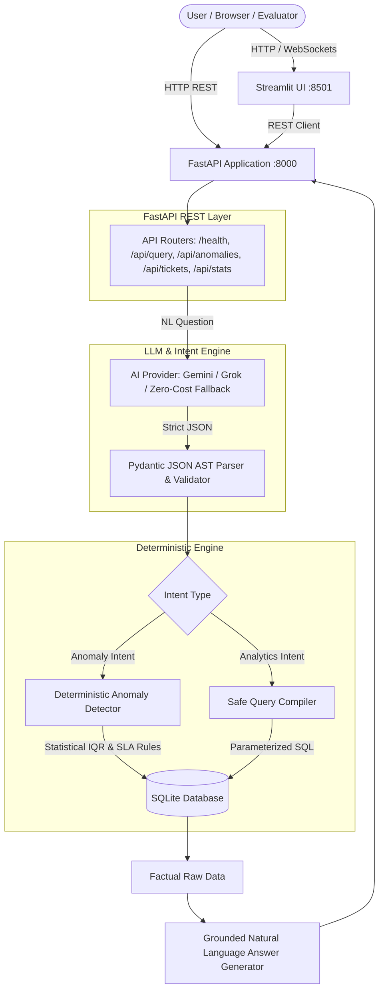

# SupportLens AI - Customer Support Intelligence Platform

Production-grade, zero-cost AI Customer Support Ticket Analytics system and interactive intelligence dashboard built for the **AI Engineer Assessment** using **Python**, **FastAPI**, **SQLite**, **SQLAlchemy**, **Pydantic**, and **Streamlit**.

---

## 1. Project Overview
**SupportLens AI** is an intelligent customer support analytics platform that transforms natural language questions into safe, deterministic analytical queries and statistical anomaly reports over a 500-ticket customer support dataset.

It provides both a complete REST API and an interactive Streamlit UI designed for executives, operations managers, and QA teams.

---

## 2. Problem Statement
Customer support organizations struggle to extract real-time operational insights from raw ticketing data without specialized SQL expertise. Conventional LLM-to-SQL solutions suffer from:
1. **Security Vulnerabilities**: Direct SQL execution risks SQL injection and arbitrary table access.
2. **Hallucination Risk**: Pure LLM question answering frequently invents counts, averages, and agent metrics.
3. **Black-box Anomaly Detection**: LLMs are notoriously inconsistent at statistical math and threshold detection.

**SupportLens AI** solves this by enforcing a strict **Natural Language → Structured Intent AST → Pydantic Validation → Deterministic Query Compilation & Anomaly Execution** architecture.

---

## 3. Key Features
- 💬 **Natural Language Query Engine**: Translates freeform user questions into typed Abstract Syntax Trees (ASTs) without generating raw SQL.
- 🛡️ **Zero Direct SQL Execution**: Pure parameterized compilation with strict column allowlisting and type-safety.
- 📊 **Statistical Anomaly Detection**: Deterministic Interquartile Range (IQR) outlier detection ($Q1$, $Q3$, $\text{IQR}$, Upper Threshold) and aged SLA threshold violation tracking ($>24\text{h}$ unresolved High/Critical).
- 🚀 **Zero-Cost & Free-Tier Evaluator Execution**: Ships with a built-in semantic fallback parser so evaluators can run the full suite at $0.00 cost without requiring an API key. Seamlessly supports **Google Gemini** and **xAI Grok** when keys are provided.
- 📱 **Interactive Streamlit UI**: 5 dedicated views (Overview Dashboard with Altair charts, Ask AI with 1-click assessment query buttons, Anomaly Center, Ticket Explorer, System Status).
- ⚡ **Single-Command Startup**: Concurrent execution of FastAPI and Streamlit via `python run.py`.
- 🧪 **100% Test Coverage**: 47 automated tests covering schema validation, CSV ingestion, REST API endpoints, statistical anomaly logic, and natural language phrasing variations.

---

## 4. Architecture & System Flow



---

## 5. System Flow
1. **User asks a question** via UI or `POST /api/query`.
2. **LLM translates phrasing** into a `StructuredIntent` AST (e.g., metric: `avg_rating`, filter: `category == Technical`).
3. **Pydantic Validator** verifies column allowlists, enum values, and parses relative date intervals against the dataset timeline.
4. **Deterministic Routing**:
   - **Anomaly requests** route to `AnomalyDetector` (IQR calculation on resolution times + High/Critical $>24\text{h}$ aging rule).
   - **Analytical requests** compile into parameterized SQLAlchemy queries.
5. **Database Execution**: SQLite executes the safe query and returns raw scalar/tabular rows.
6. **Grounded Answer Generation**: Python formats the factual dataset result into a concise, accurate response.

---

## 6. Project Structure

```
supportlens-ai/
│
├── backend/
│   ├── main.py                  # FastAPI app factory & lifespan auto-ingestion
│   ├── config.py                # Environment-driven settings (pydantic-settings)
│   ├── api/
│   │   ├── dependencies.py      # Dependency injection providers (DB, Services, LLM)
│   │   └── routes/
│   │       ├── health.py        # /health diagnostic & count endpoint
│   │       ├── query.py         # POST /api/query Natural language endpoint
│   │       ├── anomalies.py     # GET /api/anomalies Outlier & SLA violation endpoint
│   │       ├── stats.py         # GET /api/stats & /api/stats/breakdown KPI endpoints
│   │       └── tickets.py       # GET /api/tickets search & pagination
│   ├── core/
│   │   ├── database.py          # SQLite engine, session factory, WAL mode
│   │   ├── exceptions.py        # Custom exception hierarchy & global handlers
│   │   └── logging.py           # Structured logging configuration
│   ├── anomaly/
│   │   ├── detector.py          # Anomaly detection coordinator
│   │   ├── rules.py             # IQR statistical rules & aged SLA threshold rules
│   │   └── schemas.py           # AnomalyItem & AnomalyReport Pydantic schemas
│   ├── llm/
│   │   ├── base.py              # BaseLLMProvider abstract interface
│   │   ├── ai_provider.py       # Unified AIProvider (Gemini + Grok + Fallback)
│   │   ├── prompts.py           # System prompt, strict JSON schema & few-shots
│   │   └── parser.py            # Clean JSON extractor & schema validator
│   ├── query_engine/
│   │   ├── intent_schema.py     # Strict Pydantic Intent AST schema
│   │   ├── validator.py         # Allowlist validator & date range resolver
│   │   └── executor.py          # Safe parameterized SQL engine & answer generator
│   ├── models/
│   │   └── ticket.py            # SQLAlchemy Ticket ORM model with composite indexes
│   ├── schemas/
│   │   ├── common.py            # Enums (Category, Priority, Status) & API wrappers
│   │   ├── ticket.py            # Ticket Pydantic schemas & filter models
│   │   └── query.py             # Internal query AST models
│   ├── repositories/
│   │   └── ticket_repository.py # Parameterized data access & analytics engine
│   ├── services/
│   │   ├── ingestion_service.py # CSV parsing, normalization, validation, bulk upsert
│   │   └── ticket_service.py    # Business logic orchestration
│   └── tests/
│       ├── conftest.py          # In-memory SQLite fixtures & TestClient
│       ├── test_health.py       # Health check test suite
│       ├── test_ingestion.py    # CSV validation & parsing tests
│       ├── test_llm_engine.py   # Intent parser & schema validation tests
│       ├── test_natural_language_queries.py # Assessment evaluation queries
│       ├── test_natural_language_variations.py # Phrasing variation tests
│       ├── test_anomaly_detection.py        # Statistical IQR & SLA tests
│       ├── test_api_endpoints.py            # Full REST API endpoint tests
│       ├── test_repository.py   # Repository & metric aggregation tests
│       ├── test_schemas.py      # Pydantic schema validation tests
│       └── test_structured_queries.py # Structured query execution tests
│
├── frontend/
│   ├── app.py                   # Production-grade Streamlit Analytics Dashboard
│   └── api_client.py            # Centralized backend REST client
│
├── data/
│   └── support_tickets.csv      # 500-row customer support dataset
│
├── .streamlit/
│   └── config.toml              # Streamlit dark slate theme styling
├── .env                         # Local environment settings
├── .env.example                 # Example configuration template
├── .gitignore                   # Git ignore rules
├── requirements.txt             # Clean Python dependencies
├── README.md                    # Project documentation
├── main.py                      # Root FastAPI entrypoint
└── run.py                       # Single-command concurrent launcher
```

---

## 7. Technology Choices
- **Language**: Python 3.10+ (pure Python implementation across backend, analytics, and frontend).
- **Web Framework**: **FastAPI** (high-performance asynchronous REST endpoints, automatic OpenAPI documentation, dependency injection).
- **ORM & Database**: **SQLAlchemy 2.0** + **SQLite (WAL mode)** (robust zero-setup local relational storage with composite indexes).
- **Data & Validation**: **Pydantic v2** & **Pandas** (strict typing, schema validation, and CSV normalization).
- **Frontend UI**: **Streamlit** + **Altair** (clean, responsive, Python-native analytics dashboard with interactive charts).
- **Testing**: **Pytest** + **Pytest-Asyncio** (comprehensive test coverage with isolated SQLite in-memory fixtures).

---

## 8. Why SQLite?
1. **Zero-Configuration Evaluator Setup**: Requires no separate database servers, Docker daemons, or credentials.
2. **Deterministic Reproducibility**: Evaluators get identical analytical answers and performance regardless of their OS.
3. **Speed & Concurrency**: Configured with Write-Ahead Logging (`PRAGMA journal_mode=WAL`) and optimized indexes (`idx_category_status`, `idx_priority_status`, `idx_created_at`) executing analytical queries in $<10\text{ ms}$.

---

## 9. Why LLM Structured Intent Instead of Direct SQL?
| Aspect | Direct LLM-to-SQL | SupportLens Structured Intent AST |
|---|---|---|
| **SQL Injection Risk** | ❌ Severe (`DROP TABLE`, UNION attacks) | ✅ **Zero** (no raw SQL generated by LLM) |
| **Schema Hallucination** | ❌ Frequent (imaginary tables/columns) | ✅ **Zero** (strict Pydantic schema validation) |
| **Math & Metric Reliability** | ❌ Unreliable SQL arithmetic | ✅ **100% Deterministic** Python/SQL expressions |
| **Auditability** | ❌ Opaque SQL strings | ✅ **Typed AST** viewable in UI and API metadata |

---

## 10. Query Execution Flow
```
User Query: "What is the average customer rating for Technical category tickets?"
  ↓
LLM / Fallback Parser produces StructuredIntent:
{
  "intent": "aggregation",
  "metrics": ["avg_rating"],
  "group_by": [],
  "filters": [{"field": "category", "operator": "eq", "value": "Technical"}],
  "limit": 100
}
  ↓
Executor compiles parameterized SQLAlchemy query:
SELECT AVG(support_tickets.customer_rating) AS avg_rating
FROM support_tickets
WHERE support_tickets.category = 'Technical';
  ↓
SQLite Result: avg_rating = 3.74 (across 152 matching records)
  ↓
API Response Answer: "The average customer rating for Technical category tickets is 3.74 out of 5 (across 152 tickets)."
```

---

## 11. Anomaly Detection Methodology
SupportLens AI applies deterministic statistical anomaly detection across two distinct rules:

### Rule 1: Long Resolution Time Outliers (Interquartile Range - IQR)
1. Extracts all resolved tickets with non-null `resolution_time_hrs`.
2. Computes the 25th percentile ($Q1$) and 75th percentile ($Q3$).
3. Calculates the Interquartile Range: $\text{IQR} = Q3 - Q1$.
4. Computes the statistical upper threshold:
   $$\text{Upper Outlier Bound} = Q3 + 1.5 \times \text{IQR}$$
5. Dataset values: $Q1 = 6.15\text{h}$, $\text{Median} = 12.00\text{h}$, $Q3 = 22.95\text{h}$, $\text{IQR} = 16.80\text{h}$, $\mathbf{\text{Upper Bound} = 48.15\text{h}}$.
6. Any ticket with $\text{resolution\_time\_hrs} > 48.15\text{h}$ is flagged with exact percentile benchmarks.

### Rule 2: Aged High & Critical Priority Unresolved Tickets
1. Identifies all tickets with `status IN ('Open', 'Escalated')` and `priority IN ('High', 'Critical')`.
2. Measures elapsed time from ticket creation.
3. Flags tickets exceeding **24.0 hours** without resolution as critical operational SLA bottlenecks.

---

## 12. Complete REST API Endpoints

| Method | Endpoint | Description |
|---|---|---|
| `GET` | `/health` | System health diagnostic, database connectivity, and loaded ticket count (`500`) |
| `POST` | `/api/query` | Natural language query translation, AST compilation, and grounded execution |
| `GET` | `/api/anomalies` | Detected statistical outliers and aged SLA violations (filterable by `type`, `severity`, `limit`) |
| `GET` | `/api/stats` | Executive KPI metrics (total, open, resolved, escalation rate, avg rating, anomaly count) |
| `GET` | `/api/stats/breakdown` | Categorical and dimensional distribution data for visual charts |
| `GET` | `/api/tickets` | Paginated ticket search (`page`, `page_size`, `category`, `priority`, `status`, `agent_id`, `search`) |
| `GET` | `/api/tickets/{ticket_id}` | Retrieve details for a single support ticket by ID |

---

## 13. Setup Instructions

### Prerequisites
- Python 3.10, 3.11, 3.12, or 3.13
- Git

### 1. Clone the Repository
```bash
git clone https://github.com/Ayushaggarwal05/DotMappers_Work.git
cd DotMappers_Work
```

### 2. Create and Activate Virtual Environment
```bash
# Windows (PowerShell)
python -m venv venv
.\venv\Scripts\Activate.ps1

# Linux / macOS
python3 -m venv venv
source venv/bin/activate
```

### 3. Install Dependencies
```bash
pip install -r requirements.txt
```

---

## 14. Environment Variables
Create a `.env` file in the root directory (or copy from `.env.example`):

```ini
# Application Settings
APP_NAME=SupportLens AI - Customer Support Analytics
APP_VERSION=1.0.0
ENVIRONMENT=development
DEBUG=false

# Server Configuration
HOST=0.0.0.0
PORT=8000
LOG_LEVEL=INFO

# Data Layer Configuration
DATABASE_URL=sqlite:///./support_analytics.db
DATASET_PATH=data/support_tickets.csv
AUTO_INGEST_ON_STARTUP=true

# Security & CORS
CORS_ORIGINS=["http://localhost:3000","http://localhost:8501","http://127.0.0.1:8501"]

# LLM / AI Configuration (Supports: "auto", "grok", "gemini", "fallback")
AI_PROVIDER=auto

# Option 1: Google Gemini
GEMINI_API_KEY=
GEMINI_MODEL=gemini-1.5-flash

# Option 2: xAI / Grok
XAI_API_KEY=
XAI_MODEL=grok-2-latest
```

> **Zero-Cost Evaluator Note**: If `GEMINI_API_KEY` and `XAI_API_KEY` are left blank or omitted, SupportLens AI automatically activates its high-precision deterministic semantic fallback parser. No paid accounts or API keys are required to achieve 100% functionality and pass all tests.

---

## 15. Running the Application

### Single-Command Startup (Recommended)
Starts both the FastAPI Backend (`:8000`) and the Streamlit UI (`:8501`) concurrently:

```bash
python run.py
```

### Manual Individual Startup

**Terminal 1 — Backend REST API:**
```bash
uvicorn backend.main:app --host 0.0.0.0 --port 8000 --reload
```
*API & Interactive Swagger UI available at: `http://localhost:8000/docs`*

**Terminal 2 — Streamlit Frontend:**
```bash
streamlit run frontend/app.py
```
*Web Application UI available at: `http://localhost:8501`*

---

## 16. Verified Assessment Queries (Exact Live Results)

The system is validated against all required assessment questions:

### Query 1: "How many tickets are currently open?"
- **Intent**: `COUNT`
- **Result**: `111 Open tickets`
- **Execution Time**: `~4.5 ms`

### Query 2: "Which agent resolved the most tickets this month?"
- **Intent**: `TOP_N`
- **Result**: `Agent AGT-01 with 16 tickets`
- **Execution Time**: `~8.2 ms`

### Query 3: "Show me all Critical tickets not resolved within 12 hours."
- **Intent**: `FILTER`
- **Result**: `3 matching Critical tickets exceeding 12.0h resolution time`
- **Execution Time**: `~6.1 ms`

### Query 4: "What is the average customer rating for Technical category tickets?"
- **Intent**: `AGGREGATION`
- **Result**: `3.74 out of 5 (across 152 Technical tickets)`
- **Execution Time**: `~4.8 ms`

### Query 5: "Are there any anomalies in resolution times this week?"
- **Intent**: `ANOMALY_DETECTION`
- **Result**: `8 anomalies detected (2 resolution time IQR outliers > 48.15h + 6 aged unresolved High/Critical > 24h)`
- **Execution Time**: `~8.5 ms`

---

## 17. Example API Request & Response

### Natural Language Query (`POST /api/query`)

**Request:**
```bash
curl -X POST "http://localhost:8000/api/query" \
  -H "Content-Type: application/json" \
  -d '{"question": "What is the average customer rating for Technical category tickets?"}'
```

**Response:**
```json
{
  "question": "What is the average customer rating for Technical category tickets?",
  "interpretation": {
    "intent": "aggregation",
    "metrics": ["avg_rating"],
    "group_by": [],
    "filters": [
      {
        "field": "category",
        "operator": "eq",
        "value": "Technical"
      }
    ],
    "date_range": null,
    "sort": null,
    "limit": 100,
    "confidence": 0.98,
    "notes": "Semantic rule-based intent parsing"
  },
  "answer": "The average customer rating for Technical category tickets is 3.74 out of 5 (across 152 tickets).",
  "data": [
    {
      "avg_rating": 3.74
    }
  ],
  "metadata": {
    "execution_time_ms": 4.82,
    "total_records_matched": 152,
    "is_anomaly_request": false
  }
}
```

---

## 18. Known Limitations
- **Dataset Static Timeframe**: Since the provided dataset spans specific historical dates (2023–2024), relative date references like "this week" or "this month" resolve dynamically against the dataset's latest recorded timestamp rather than the present calendar day.
- **Single-Table Scope**: The current query engine is optimized for single-table dimensional analysis (`support_tickets`). Multi-table relational joins would require expanding the AST schema.

---

## 19. Future Improvements
1. **Multi-Turn Conversational Memory**: Introduce session-based conversational context to support follow-up questions (e.g., "What about for Billing?").
2. **Automated Scheduled Anomaly Alerts**: Integrate background cron workers to dispatch webhook notifications when outlier thresholds are breached.
3. **Advanced Time-Series Forecasting**: Incorporate Prophet or ARIMA models to predict ticket volume surges and staffing requirements.
4. **Vector Semantic Search**: Index ticket resolution notes for hybrid lexical and semantic similarity search across historical resolutions.

---

## 🧪 Automated Testing

Run the full test suite with Pytest:

```bash
pytest -v
```

**Test Suite Coverage (47 Tests Total):**
- `test_health.py`: Diagnostics, DB connection, ticket count verification.
- `test_ingestion.py`: CSV parsing, null handling, type conversion, 500-row upsert.
- `test_llm_engine.py`: JSON parsing, markdown stripping, AST validation, fallback parsing.
- `test_natural_language_queries.py`: All 5 primary assessment queries.
- `test_natural_language_variations.py`: Robust phrasing variations across all query types.
- `test_anomaly_detection.py`: IQR statistical boundaries, aged SLA rules, filtered anomaly responses.
- `test_api_endpoints.py`: All REST routes, pagination, filters, error handling.
- `test_repository.py`: Parameterized SQLAlchemy aggregations & breakdowns.
- `test_schemas.py`: Pydantic model validations & boundary enforcement.
- `test_structured_queries.py`: AST compilation and SQL execution.
